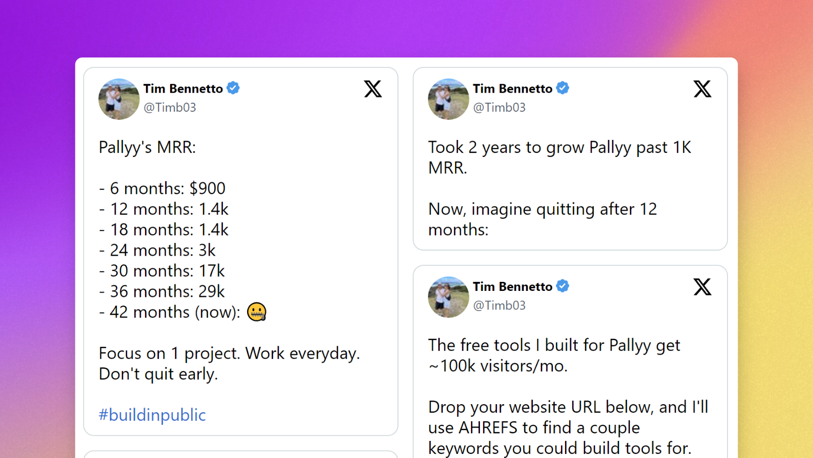

# Nuxt Twitter Testimonial

[![npm version][npm-version-src]][npm-version-href]
[![npm downloads][npm-downloads-src]][npm-downloads-href]
[![License][license-src]][license-href]
[![Nuxt][nuxt-src]][nuxt-href]

Create a Twitter testimonial wall for your website.

- [✨ &nbsp;Release Notes](/CHANGELOG.md)
- [🏀 Online playground](https://stackblitz.com/github/your-org/nuxt-twitter-testimonial?file=playground%2Fapp.vue)

## Features

- 👏🏻 Show off your favourite tweets
- 🍱 Customizable Masonry layout
- 💿 Server side cached for speed
- 🌪 No layout shift (SSR)
- ⚡ Fast & Easy setup

## Quick Setup

1. Add `nuxt-twitter-testimonial` dependency to your project

```bash
pnpm add -D nuxt-twitter-testimonial
yarn add --dev nuxt-twitter-testimonial
npm install --save-dev nuxt-twitter-testimonial
```

2. Add `nuxt-twitter-testimonial` to the `modules` section of `nuxt.config.ts`

```js
export default defineNuxtConfig({
  modules: ["nuxt-twitter-testimonial"],
});
```

That's it! You can now use Nuxt Twitter Testimonial in your Nuxt app ✨

## Usage

We provide a simple `<NuxtTestimonial />` component that you can add to your website.

**Example**

```vue
<template>
  <NuxtTestimonial
    :ids="ids" 
    :show-media="false"
    :max-columns="columns"
    :column-width="width"
  />
</template>

<script setup>
const ids = ref([
  "1683982469752840193",
  // ... more twitter ids
]);
const columns = ref(2);
const width = ref(200);
</script>
```


<!-- Badges -->
[npm-version-src]: https://img.shields.io/npm/v/nuxt-twitter-testimonial/latest.svg?style=flat&colorA=18181B&colorB=28CF8D
[npm-version-href]: https://npmjs.com/package/nuxt-twitter-testimonial

[npm-downloads-src]: https://img.shields.io/npm/dm/nuxt-twitter-testimonial.svg?style=flat&colorA=18181B&colorB=28CF8D
[npm-downloads-href]: https://npmjs.com/package/nuxt-twitter-testimonial

[license-src]: https://img.shields.io/npm/l/nuxt-twitter-testimonial.svg?style=flat&colorA=18181B&colorB=28CF8D
[license-href]: https://npmjs.com/package/nuxt-twitter-testimonial

[nuxt-src]: https://img.shields.io/badge/Nuxt-18181B?logo=nuxt.js
[nuxt-href]: https://nuxt.com

